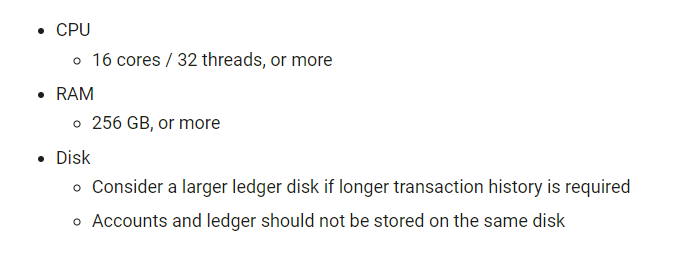

## Introduction

Recently, the rapid growth and widespread adoption of blockchain technology have sparked considerable interest in the subject of network scalability. As more users and companies' interests grow towards the industry, understanding the potential scaling solutions of these networks becomes increasingly important. This article aims to provide a comprehensive introduction to blockchain scalability, as well as dispel common misconceptions surrounding the topic, so we can also spot bad scaling solutions from new projects claiming to have solved the problem.

## What to do?

Before going into any solution, it's worth saying that you can not scale a blockchain network just by what it is. If you simply reduce the block time and tune up the block size, it only makes the hardware requirements of running a node for the network higher. For example, Ethereum currently has a 12 second block time and roughly 1.5mb block size which brings a hardware requirement of 8gb RAM and a duo-core CPU, comparable to an average person's computer. Bitcoin, which has a 10 minute block time and a 1mb block size, can even be ran on a phone back in 2010! Now, let's take a look at Solana, it has a 0.5 second block time and a theoretically-possible 128mb block size, and here are the requirements to barely run a node for it:

	

To gain performance, Solana developers make it so that only the super-rich and datacenters can run nodes!

Not being able to run nodes make the network centralized as users have to rely on centralized node providing services like Infura, Moralis, Quicknode, etc. The only way to scale up a blockchain is to move the heavy work out of the blockchain while having some connection to the chain and/or use cryptographic tricks so that even when tasks are not entirely done on the blockchain, it still works correctly and trustlessly.

Ideally, "good" scaling solutions are:
- "Decentralized" - People can perform those off-chain computation on their own, or there exists a network with many participants doing that for you, and this network must provide a reasonable way for people to join in (because that network is forever centralized to only those existing participants otherwise).
- "Secure" - There should not be any way or any reasonable way for an attacker or a centralized entity to attack and manipulate the protocol, and the security of the protocol *remains approximately the same even if the network scales up further.*

## State channels & Plasma

To start it off, we will have a look at two simplest "layer 2" scaling solutions - state channels and plasma chains.

### State channels

	

 

The basic idea of state channels is that, given a situation of a limited group of people wanting to transact with each other, you can deposit assets into a smart contract on-chain, write down planned transactions, compute the result at the end on your own, not on the blockchain, and only submit one final transation to confirm this result on-chain with agreement from a *considerate* amount of the people in that group through their signatures (also known as a multisig). State channels are incredibly useful in cases where known parties have to make multiple transactions back and forth in a period of time, since it reduces all tasks to only one or two transactions, and every channel's transaction being made are done instantly because it's not on-chain, but just a mutual short-term agreement between the parties. 

State channels are superior for large payments, people should use them to transfer money if they can because of how fast and cheap it is for the purpose. It is just as fast as normal payment applications that you are familiar with, and above all, you don't have to pay for any transfers made in state channels, the only thing you are paying for is channel creation/settlement on-chain. So if you are making hundreds of money transfers, you are just paying for 1 or 2 transactions.

However, there are several drawbacks to such protocol. If there are not many transactions going on, it might not be exactly useful, because it reduces `n` transactions to just 1 or 2 transactions, so if you are just making one transfer, it does not really solve anything in that case. Furthermore, the only thing you can do is payments across a *limited group of people* due to the protocol's reliance on multisig to work. If you expand it to a global level, faulty people might not agree for others to withdraw their assets, which is why such system can only be used for a group of 2-20 people. It is also impossible to build many types of applications just by using channels, because again, it's limited to a group of parties, so something like a complex decentralized lending protocol which relies on global consensus is not possible.

In practice, this type of scaling solution is very popular towards high-end Bitcoin users. Any serious Bitcoin user who has dig deep enough would know about Lightning Network and use it for normal payments.

### Plasma chains

Another type of scaling solution that's also limited to a group of parties is plasma chain. The basic idea is that you deposit some assets into the plasma protocol, then, you or any other party in the same transacting group keep transactions off-chain and post state commitment claiming the resulting state of those transactions to the layer 1 periodically. If any party thinks that the commitment is false, they create a dispute and submit proof that this commitment is faulty. In the end, you can choose to withdraw your assets corresponding to the current state commitment by submitting your account's state.

Plasma chains open up for more applications than state channels. Take chess for example, state channels can not be used for such purpose because it requires signatures from both players to get the result of the game on-chain. Of course, the loser can just not sign the signature. With plasma chains however, all moves are recorded off-chain, you can use that to construct a proof against the faulty state commitment (if it is faulty), or create an interactive dispute with the uploader on-chain. Basically, while state channels rely on a multi-sig, plasma chains rely on provable off-chain computation.

It does suffer from one big problem though which is data availability, if there is a loss of transactions or unclear transaction ordering, participants might not be able to submit proof on-chain against the faulty state commitment. This is also why it's limited to a group and can not be used globally, but we will see a very similar model in the next part of this article.

## Sharding & rollups

	

Another approach of scaling the blockchain is to split it into many smaller chains, which reduce the overall computation and data storage needed for each of the chain, which is often called "sharding", or considered as "rollups" - another type of layer 2 scaling solution.

Sharding is often misunderstood, cause many think it is just literally splitting one chain into child chains without doing anything extra. This would cause huge consensus security concerns, cause by having multiple chains with their own consensus performing a 51% attack is much easier, and if one child chain falls, the whole network falls. Another problem might be that those chains are not connected and the process of communicating between the chains might be a difficult problem.

The correct way to shard the chains is to use one chain as a consensus layer, and then have multiple child chains (or "rollups") uploading their transactions onto it. By doing this, no single child chain have to have their own consensus which means consensus security is not reduced. But the special part about this is that the child chains only care about their chain's transactions posted on the beacon chain and have their own independent state. They do not do anything with other chains' data, transactions from other chains are just there in the beacon block but ignored by them. By doing this, we have sharded transaction computation and state storage from one chain to multiple ones.

To bridge the token from the beacon chain to the rollup and reverse, usually there are two classes of rollups to ensure correctness of the state - Optimistic rollups and ZK rollups. Both upload a state root as a commitment to the global rollup's state, zk rollups will have a small-and-cheap-to-verify proof that can prove correctness of a rollup block uploaded, while Optimistic rollups utilize a fraud proof system, where a rollup block is considered truthy until someone says that it doesn't and challenges the person who uploaded the block. However, if there is not a native bridge from the rollup to the layer 1 and reverse, these schemes are not needed, people often call this type of rollups "sovereign rollups" or "sovereign embedded chains" which is as independent as a normal layer 1, but does not require any extra consensus security. However, it comes with a drawback of bad economy (because it will need its own token) and insecure asset migration (cause bridge is not native to the rollup, developers will have to build layer 1 to layer 1 type of bridges).

But you might have noticed that the one thing we didn't shard is data availability (aka the block, the transaction batches etc). Even though everything is cheaper because state access/storage is lower, the amount of transactions handled by the entire network is still the same since the block size is still the same, and we are just processing just as much transactions! So to scale up, we would need to shard data availability (or DA sharding for short). The idea is fairly simple, you have special pieces of data on the beacon block called "blobs", and you have a cryptographic commitment of each of these blobs stored on each L1 blocks. Rollups will upload their data availability (transactions and other data) as these blobs. The unique thing about this model is that nodes will just verify these blobs once against their commitment and then drop them, only storing the commitment. Rollups store their own blobs and ignore others, but they can still request those blobs from other rollup nodes if they wanted to and verify them using the commitment stored. This is also where it is different from just increasing the block size, by increasing the block size, everyone has to store **all** of the big blocks and process **all** of the transactions, but in this case, seperate child chains deal with their individual small blocks, and they together add more throughput to the whole network. Through this solution, transaction throughput will increase since more transactions can be handled while sacrificing little computation cost. The only problem with this solution is that there are still the one-time data transportation cost and the cost to verify commitments, so we can only shard data availability to an extent.

Rollups and DA sharding are incredibly powerful in that it has the same capability as a normal blockchain network, and is the only current safe way to have a "multichain-ish" network.

### Compression tricks

Although this is not necessarily related to sharding, it's commonly used in Ethereum rollups to gain more capacity because DA sharding is not yet implemented in/before the time of writing, hence the name "rollups". The idea is that if transactions are smaller, rollups can fit in more transactions.

To understand how this works, we must have a basic idea of a simple transaction, then we will have a look at how each property can be compressed. 

* Nonce (~3 bytes): Basically entropy so that transactions have different signatures. This can be omitted entirely because we can get the current nonce directly from state, which reduces 3 bytes.
* Gasprice (~8 bytes): How much would a the person pay for 1 gas. We can make the user pay within a fixed range of gasprices, eg. a choice of 16 consecutive powers of two, or can be omitted entirely and gas will be paid to block proposers using other sources like a state channel, which would get to 0-0.5 bytes.
* Gas (3 bytes): Amount of gas. We can either use the same trick as above, or remove it entirely using a fixed-size gas, which would get to 0-0.5 bytes also.
* To (21 bytes): Receiver's address. We can make an account manager to reduce receiver's address. Basically, an address will be registered with an index, and a reasonable index size would be somewhere 4 bytes which we can ensure that we would not be able to max out for several lifetimes.
* Value (~9 bytes): Amount to transact. We can use scientific notations for this, which would result in approximately 3 bytes.
* Signature (~68 bytes): Signature of the transaction. We can use BLS signature aggregation for this. The basic idea is that you can aggregate multiple signatures into only one signature. The cost is fixed to only one signature, so let's just say this one takes approximately 0.5 bytes per transaction.
* From (0 byte): Sender's address. Originally we can omit the sender address because it can be recovered from the signature, but in this case we need it to verify the aggregated signature. So that's 4 bytes added.

(Taken from Vitalik's blog on rollups).

Overall, we have reduced a transaction with the size of ~112 bytes to somewhere around ~12 bytes - almost a ten-time improvement in transaction capacity!

One more important note is that in many cases of a zk rollup, some transaction fields can be removed entirely because they have been proven through the zk proof already, e.g. signatures.

### Going layer 3?

A wild thought would be to stack rollups on top of each other. While this may sound like a nice idea, it just doesn't work, because in the end data availability is the same and no improvement in capacity is being added. However, we can build state channels and plasma chains on top of rollups.

## Cryptographic tricks

Cryptographic tricks refer to all sorts of cryptography usage in optimization of the blockchain, but here are some of the most popular use cases.

### ZK proof

There are three important aspects in a blockchain: verification, execution, and data storage, succinct zk proof schemes like SNARKs or STARKs can vastly improve efficiency in verification and execution, which results in more capacity gained. 

### Data storage commitment

How would we deal with data storage then? First, we will split it into two types of data storage, chain-related storage and application storage. Chain-related storage can only be optimized through sharding tricks mentioned above, state data sharding through rollups and then do data availability sharding. But with the case of application storage, we have a slightly different approach.

The idea is similar to what I have mentioned about DA sharding, you keep some cryptographic commitment on-chain, store data off-chain, and can then request the data from a p2p network like IPFS or a similar DHT protocol and verify it with the commitment stored. Only problem with this is that data is voluntarily stored, so if your app has a large userbase or a model that makes people host data behind the scene, it would work, but otherwise it wouldn't. A further approach would be to have a protocol similar to Sia, which pays hosts to store data, uses the same data sampling trick for proof of storage, punishes hosts if they don't store data, and incentivizes at download time in an *optimistic* way - paying accordingly to the data received, so that they would provide data at any time.

## Optimizations

All of the things I have mentioned earlier are pretty abstract and general, in pratice, protocol designs play a huge role in scalability. How you deal with data serialization, message gossiping, trie construction, stuff like segwit, parallel utxo transactions etc can vastly reduce cost and improve overall transaction throughput. Optimization tricks to reduce data cost, disk io cost, pruning etc from blockchain clients are also just as essential.

## Indirect scaling solutions

### Better smart contract languages/compilers

While this may sound dumb, it is actually a fair point.

First, let's talk about contract execution. A bad contract language design/compiler would produce unnecessary opcodes, meaning more execution needed. For example, a contract written in Huff or Vyper (with their current official compilers) might be twice or even three times more gas efficient than one that was written in Solidity (using the solc compiler). We don't even need to shard another chain or use another rollup in the first place if devs adopt those languages rather than Solidity.

Second, let's talk about contract code storage. Again, a bad contract language design/compiler would produce unnecessary opcodes, and that not only contribute to worsened execution efficiency, but also data storage cost for those contracts. A few months prior to the current time of writing, a research has shown that 10% of Solidity contracts in Ethereum are useless opcodes generated by the solc compiler. Yep, tens of gigabytes of the Ethereum blockchain network currently are probably solc bloat, yikes!

People seem to not realize the damages a bad smart contract language may bring. Sure, it hurts apps' performance individually, but the problem is more complicated when a language is mass-adopted. A mass-adopted smart contract language that has 3x more opcodes and 3x lower gas efficiency directly contributes to the network being 3 times less scalable than what it could have been. We don't even need to shard 3 extra chains, we need a better smart contract language designs and compilers!

This solution does not help with scaling blockchains directly, as it does not add in any extra execution or data storage capacity, but rather help recover the performance that they have lost due to unoptimized use of smart contracts and help reduce chain bloat.

## Common misconceptions

### Proof-of-stake improves scalability

A common misconception that most modern blockchain networks lie to users and investors about is the fact that Proof-of-stake is more scalable than Proof-of-work or other consensus mechanisms. This is actually false since consensus protocols don't bring any extra transaction execution or data storage capabilities to the network, PoS-based consensus protocols exist only as an energy-efficient way to achieve consensus compared to PoW mining. Most centralized blockchain networks that have low block time and high block size will take PoS as an excuse for their centralized scalability.
